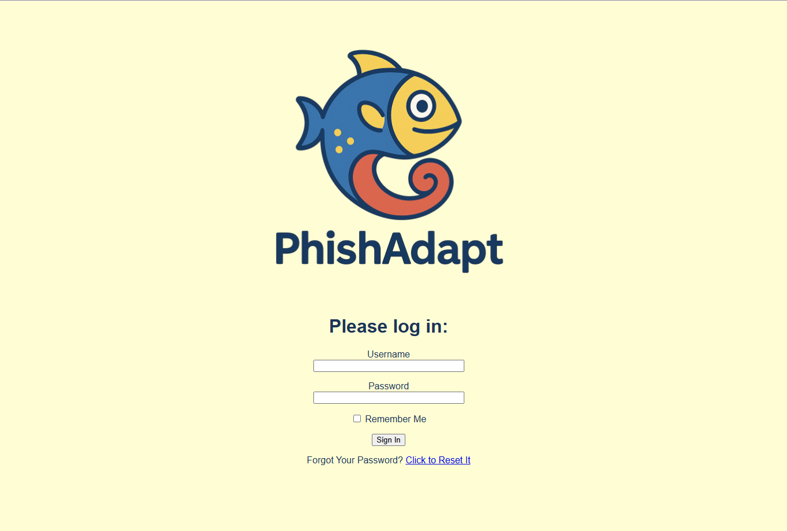
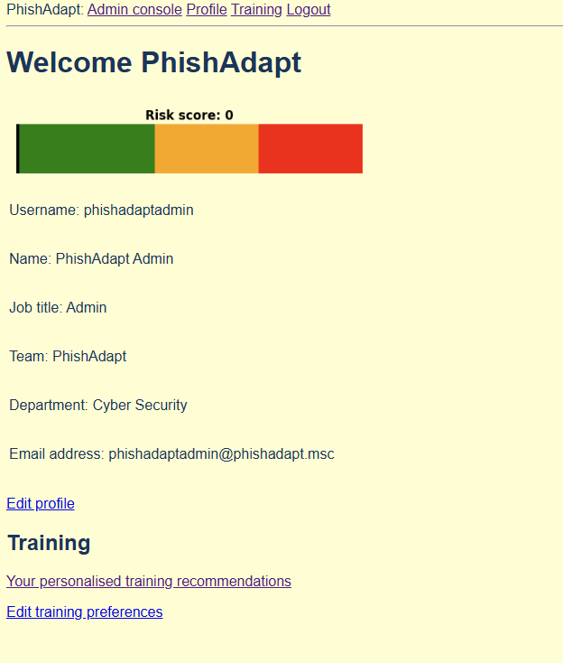
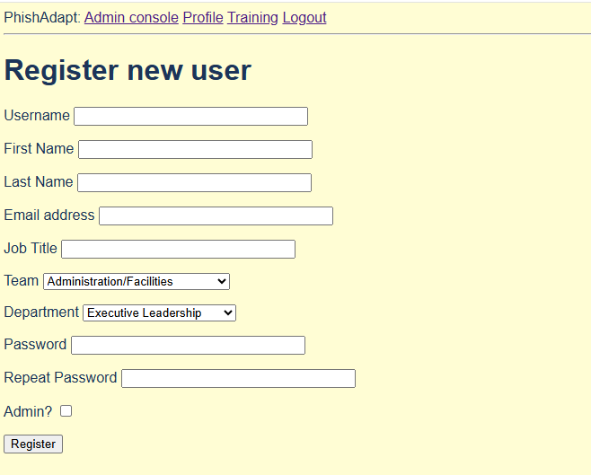
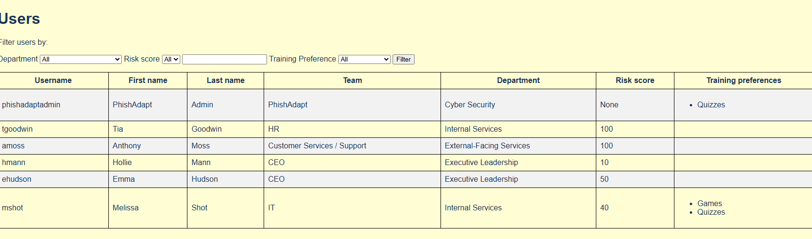
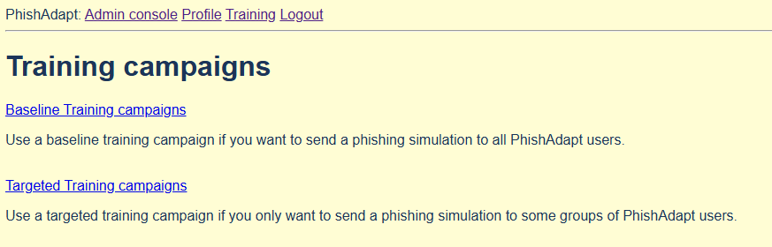
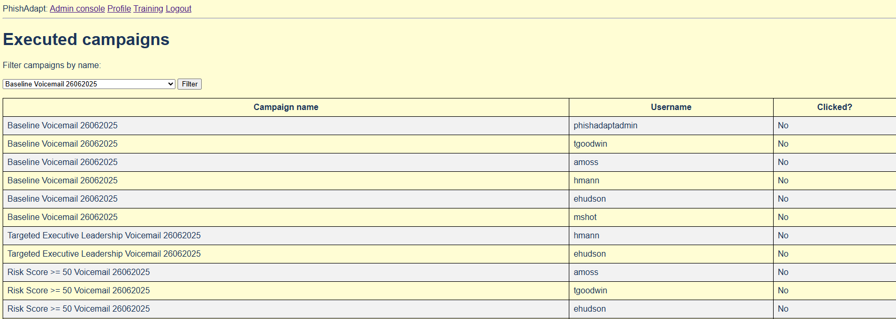
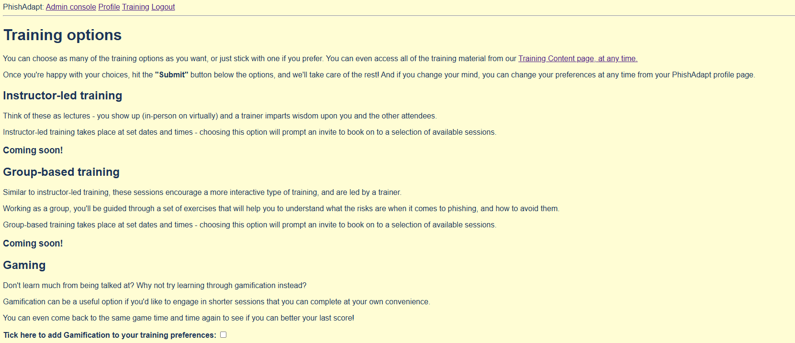
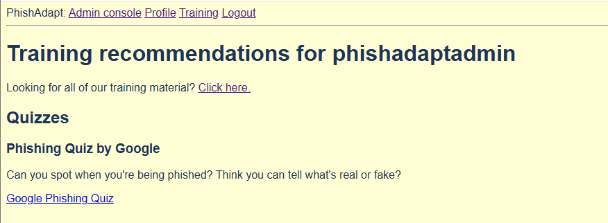

# PhishAdapt


_A customisable phishing awareness training platform_  

PhishAdapt is a web application developed as the practical artefact for an MSc dissertation on phishing awareness training. The system delivers customisable phishing simulations and personalised training content based on user preferences and emotional responses, aiming to improve engagement and behavioural outcomes.

## Features

- Customisable phishing simulation delivery
- Training preference personalisation (e.g., video, quizzes, reading)
- JWT-based user interactions
- Admin dashboard for viewing user risk scores and interaction metrics
- User profile updating, including self-service password reset

## Tech Stack

- **Frontend:** HTML, CSS, Jinja
- **Backend:** Python (Flask)
- **Database:** SQLite
- **Libraries/Tools:** 
  - Flask-Login
  - Flask-Mail
  - Flask-Migrate
  - Flask-WTF
  - PyJWT
  - Flask-SQLAlchemy
  - Pandas
  - Matplotlib

## Getting Started

These instructions will help you set up the project locally.

### Prerequisites

Make sure you have the following installed:

- Python 3.12+
- pip (Python package manager)
- Git

### Installation

1. **Clone the repository**

```bash
git clone https://github.com/janekpstudentuad/PhishAdapt
cd phishadapt
```

2. **Create and activate a virtual environment**

```bash
python3 -m venv venv
source venv/bin/activate  # Or on Windows: venv\Scripts\activate
```

3. **Install dependencies**

```bash
pip install -r requirements.txt
```

4. **Initialise and create user database**

```bash
flask db init
flask db migrate -m "users table"
flask db upgrade
```

5. **Create administrator user and populate teams/departments into database**

```bash
flask shell

# Create admin user
u = User(username='your-admin-username', firstname='your-admin-user-firstname', lastname='your-admin-user-lastname', email='your-admin-user-email-address', jobtitle='your-admin-user-job-title', team='your-admin-user-team', department='your-admin-user-department', is_admin=True)  # Adjust values as required

u.set_password('your-admin-user-password')  #Adjust as needed

db.session.add(u)

# Populate teams and departments
rows = [
    {"department": "your-department-1", "team": "your-team-1"},
    {"department": "your-department-2", "team": "your-team-2"}, # Adjust values as required, add or remove entries as needed
]

for row in rows:
    r=Organisation(**row)
    db.session.add(r)

db.session.commit()
```

6. **Run the application**

```bash
flask run
```

The app will be available at http://localhost:5000

## Project Structure

```bash

phishadapt/
│
├── app/                    # Main app
│   ├── admin/              # Blueprints for administration functions
│   ├── auth/               # Blueprints for authentication functions
│   ├── errors/             # Blueprints for error functions
│   ├── main/               # Main Flask app
│   ├── static/             # Static files (CSS, JS)
│   ├── templates/          # HTML templates
│   ├── training/           # Blueprints for training functions
│   ├── utils/              # Supporting utilities
│   ├── __init__.py
│   ├── email.py
│   └── models.py
```

## Screenshots

### Login page


### Welcome page


### Register new users


### Table of users


### Choice of training campaigns to run


### Executed campaigns


### Set training preferences


### Training recommendations page


## Context

This application was developed as part of the MSc dissertation titled:

_Evaluating Personalised Phishing Awareness Training: A Mixed Methods Study on Emotional Response, Engagement, and User Preference_

The project explores the viability of personalised delivery of phishing awareness content and aims to support further research in adaptive cybersecurity training solutions.

## License

This project is licensed under the MIT License – see the [LICENSE](LICENSE) file for details.

## Acknowledgements

- [Flask](https://flask.palletsprojects.com/en/stable/)
- All participants and experts who contributed to the study

© 2025 Jane Kocan-Payne